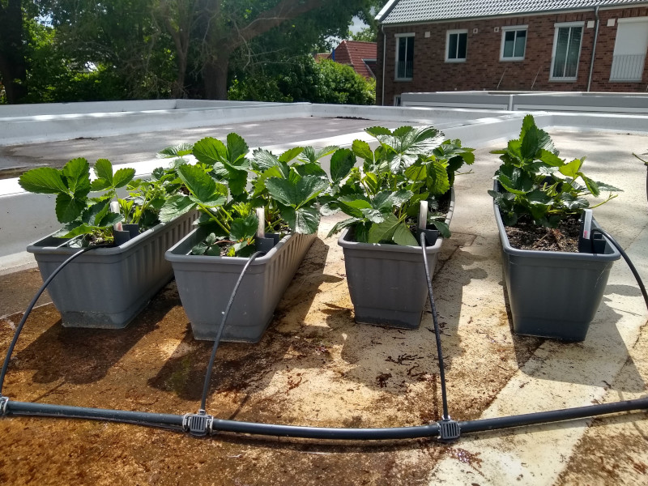

# Erdbeerfarm V0.2 - Beschreibung 

## Innenraum Garage

In der Garage befindet sich auf der Rückseite die Regentonne (210 Liter). Die Tauchpumpe ist natürlich in der Regentonne. An die Pumpe kann man am Auslass ein Winkelanschlussstück anschrauben, und daran einen Universal-Schlauchanschluss. Den Schlauchanschluss kann man für die benötigte Größe kürzen: 25mm(1"), 32mm(1 1/4") oder 33,3mm (G1 Gewinde).
Ich habe den Anschluss auf das G1 Gewinde gekürzt und den Gardena Hahnverbinder aufgeschraubt. Angeschlossen ist daran eine normale Schlauchkupplung für einen 13mm Gartenschlauch.
Die Schlauchführung auf das Garagendach erfolgt über eines der beiden Zwangsentlüftungslöcher (ca. 10cm) an der Garagenrückseite.

Die Spannungsversorgung der Tauchpumpe erfolgt über einen Shelly Plug S Zwischenstecker vom 230V Netz in der Garage. Für eine funktionierende WLAn-Verbindung ist der Shelly Plug direkt hinter dem Zwangsentlüftungsloch positioniert.

## Garagendach

Der von unten kommende Gartenschlauch geht zuerst auf ein 12mm T-Stück und wird dann relativ symmetrisch auf die 8 Blumenkästen verteilt. An das T-Stück angeschlossen ist für beide Seiten das Gardena Verlegerohr 13mm. In regelmäßigen Abständen ist das Verlegerohr von den Gardena Reduzier-T-Stück 13 mm unterbrochen, sodass jeweils vier Abgänge mit dem 4,6mm Verlegerohr in die Blumenkästen gehen. Am Ende des 13mm Verlegerohr sitzt jeweils ein Verschlussstopfen.
Das kleine 46mm Verlegerohr ist am BLumenkasten einfach durch eine kleine Bohrung duchr den Halter der Wasserstandsanzeige gesteckt.

Skizze folgt......

## Steuerung / Software
Die Ansteuerung des Shelly Zwischensteckers mache ich mit Home Assistant. Der Shelly Plug S wird über die Entity "switch.shelly_plug1" angesprochen. Auf der Weboberfläche kann der Gießvorgang manuell augelöst werden, ansonsten wird morgens bzw. abends der Gießvorgang über eine Automation ausgelöst (siehe HA_automation.yaml). Die Automation setzt beim gießen die Entity "counter.erdbeerfarm_gegossen" hoch.
Der Shelly PLug S ist im Moment so konfiguriert, dass er nach 30 Sekunden automatisch weider abschaltet. 

